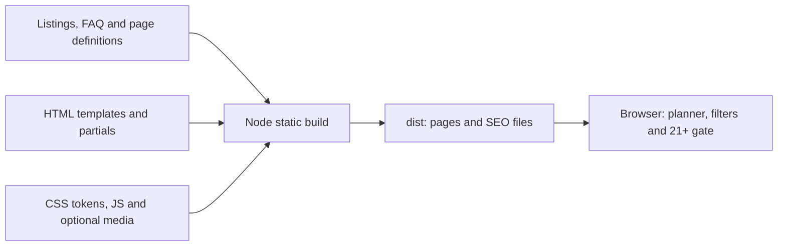

# TraveloVegas project and media map

Audit date: October 9, 2026. Source: `/Users/sharms18/Documents/Claude/TraveloVegas/`. Refreshed against Git HEAD **bb21fe0**, after another workflow merged round 4 during this review.

TraveloVegas is a static Las Vegas visitor guide with a homepage, eight category pages, 257 listing records, and no installed image or video assets. Its documented business model is affiliate commissions on tickets/tours, with restaurant links intended to improve usefulness. Named networks, commission estimates, domain registration and Cloudflare Pages hosting are intentions, not independently verified integrations or deployment facts. See [CLAUDE.md, lines 3-14](../../CLAUDE.md).

## Inventory and file roles

The initial **1,541-file** snapshot contained only a homepage implementation. It was superseded during this audit. The current [folder-inventory.csv](folder-inventory.csv) is the inventory source of truth: **1,572 files before these deliverables**, comprising 1,304 dependency files, 220 Git files and **48 files outside both**. Those 48 comprise 47 text files and `.DS_Store`; 14 are generated `dist/` artifacts. Third-party dependencies and Git internals were inventoried as groups. Project-owned source, configuration and generated output were inspected; complete content JSON and the lockfile were parsed.

```text
TraveloVegas/
├── src/                 10 page, template, partial and content files
├── data/                Listing inventory
├── config/              Affiliate query-string configuration
├── design/              Tokens and intended component recipes
├── css/                 Stylesheet
├── js/                  Browser interactions
├── scripts/             Build, screenshots and agent workflow
├── prompts-archive/     Original implementation and media briefs
├── setup/ + .claude/     Hook and local agent configuration
├── reviews/             Failed review output
├── dist/                14 generated website files
├── node_modules/        Third-party development tools
└── .git/                Repository metadata
```

`assets/`, `assets/media/` and `screens/` remain absent. `.DS_Store` is Finder metadata, not website content. Files in this new `design/media-production/` folder are excluded from the inventory baseline.

| Files | Role |
|---|---|
| [README.md](../../README.md), [CLAUDE.md](../../CLAUDE.md) | Introduction; business intentions, stack, editorial/workflow rules. |
| [package.json](../../package.json), [package-lock.json](../../package-lock.json) | Build/serve/screenshot commands; lockfile version 3 and 87 dependency package entries. |
| [.gitignore](../../.gitignore), `.DS_Store` | Generated/dependency exclusions; Finder metadata. |
| [src/index.html](../../src/index.html), [src/404.html](../../src/404.html) | Homepage and not-found templates. |
| [src/pages.json](../../src/pages.json), [src/faq.json](../../src/faq.json) | Eight category definitions and eight FAQ entries. |
| [src/templates/category.html](../../src/templates/category.html) | Shared category page template. |
| [head.html](../../src/partials/head.html), [header.html](../../src/partials/header.html), [footer.html](../../src/partials/footer.html) | Shared metadata, navigation and footer. |
| [gate.html](../../src/partials/gate.html), [21-plus-extra.html](../../src/partials/21-plus-extra.html) | Age confirmation dialog and cannabis rules panel. |
| [data/listings.json](../../data/listings.json) | Listing records, sources/dates, statuses, watch list and missing inventory. |
| [config/affiliates.json](../../config/affiliates.json) | Empty tracking-query values for three booking hosts. |
| [design/tokens.css](../tokens.css), [design/PATTERNS.md](../PATTERNS.md) | Colors/type/layout/motion tokens; intended component recipes. |
| [css/site.css](../../css/site.css), [js/site.js](../../js/site.js) | Responsive styling; menu, rails, planner, filters and age gate. |
| [build.mjs](../../scripts/build.mjs), [shots.mjs](../../scripts/shots.mjs) | Static generation/internal-link checks; Chromium screenshots. |
| [swarm.sh](../../scripts/swarm.sh), [review-loop.sh](../../scripts/review-loop.sh) | Parallel agent lanes; per-commit review output. |
| [setup/claude-settings.json](../../setup/claude-settings.json), [.claude/settings.json](../../.claude/settings.json), [.claude/settings.local.json](../../.claude/settings.local.json) | Hook template, identical active hook and MCP preferences. |
| [01-skeleton-and-hero.md](../../prompts-archive/01-skeleton-and-hero.md), [lane-data.md](../../prompts-archive/lane-data.md), [codex-review.md](../../prompts-archive/codex-review.md), [flow-prompts.md](../../prompts-archive/flow-prompts.md) | Original build, data, review and media briefs. |
| [reviews/0ed4d7e.md](../../reviews/0ed4d7e.md) | Failed CLI review log, not a completed quality review. |
| [dist/index.html](../../dist/index.html), [dist/404.html](../../dist/404.html) | Generated home/not-found pages. |
| [shows](../../dist/shows/index.html), [free](../../dist/free/index.html), [eat](../../dist/eat/index.html), [nightlife](../../dist/nightlife/index.html), [pools](../../dist/pools/index.html), [tours](../../dist/tours/index.html), [getting-around](../../dist/getting-around/index.html), [21-plus](../../dist/21-plus/index.html) | Eight generated category routes. |
| [dist/css/site.css](../../dist/css/site.css), [dist/js/site.js](../../dist/js/site.js), [sitemap.xml](../../dist/sitemap.xml), [robots.txt](../../dist/robots.txt) | Inlined-token CSS, copied JS and crawler files. |

## How the website is made

Plain HTML, CSS with native nesting and vanilla JavaScript; Node `.mjs` generation. No framework, backend, database or booking engine. Locked development tools are Playwright `1.64.0` and serve `14.2.6`; browser resources include Google Fonts and Lenis `1.3.26`. See [package.json, lines 6-25](../../package.json) and [head.html, lines 15-20](../../src/partials/head.html).

The **340-line build** filters records, renders templates/partials, generates JSON-LD, homepage, category routes, 404, sitemap and robots, inlines imported CSS, copies JS/assets, then checks internal page links and anchors. See [build.mjs, lines 206-340](../../scripts/build.mjs).



Browser code handles navigation, parallax, rail controls, single-choice category filters and an age confirmation stored as `tv-21`. The planner uses at most eight records from each of seven categories, filters the resulting **56 cards** by vibe/budget/crew tags, returns up to six, and saves preferences. It does not schedule travel, check availability or reserve anything. See [build.mjs, lines 122-139](../../scripts/build.mjs) and [site.js, lines 99-221](../../js/site.js).

## Current content inventory

| Category | Records | Category | Records |
|---|---:|---|---:|
| Restaurants | 161 | Shows | 16 |
| Attractions | 15 | Free | 11 |
| Tours | 12 | Nightclubs | 11 |
| Pool parties | 9 | Transportation | 8 |
| Strip clubs | 7 | Adult shows | 5 |
| Dispensaries | 2 | **Total** | **257** |

Statuses: **161 open, 59 likely_open, 25 closed, 8 seasonal, 2 changed, 2 temp_closed**. **228 records** have source URLs; 29 have none. Filtering closed, unsourced and explicitly hidden records yields **206 live**, then **164 confirmed nonadult**. Prices: 23 records; hours: 40; addresses: 75; `min_age`: 10; adult flags: 14. Booking labels remain 45 `vegas.com`, 10 `viator`, 202 null; actual `booking_url` fields: **zero**.

All 257 `last_checked` values and `last_full_check` remain **2026-10-08**. These are stored research assertions, not live verification performed here. Image/credit mappings, map coordinates, structured event dates/end dates and alert fields are absent. Missing inventory includes kids attractions, bars, shopping, events and birthday freebies. See [listings.json, lines 2-3 and 263-278](../../data/listings.json).

| Category page | Rendered | Confirmed |
|---|---:|---:|
| Shows | 13 | 12 |
| Free | 12 | 11 |
| Eat | 124 | 99 |
| Nightlife | 9 | 9 |
| Pools | 8 | 8 |
| Tours/attractions | 22 | 21 |
| Getting around | 7 | 7 |
| 21+ | 14 | 8 |

Category pages include sourced unconfirmed records with a banner, after confirmed records. Free trams also appear under transportation. Homepage output has ten weekly plus 56 hidden planner cards. See [build.mjs, lines 220-270](../../scripts/build.mjs).

## Implemented versus planned

| Feature | Current state |
|---|---|
| Navigation, eight categories, 404 | Implemented templates and generated routes. |
| Hero/category media slots | Implemented; assets absent. |
| Weekly rail, planner, category filters | Implemented, currently text-only cards. |
| FAQ, metadata, structured data, sitemap | Implemented. |
| 21+ confirmation/rules | Implemented browser dialog; adult booking links/images suppressed. |
| Affiliate booking | Loader/disclosures implemented; URLs and tracking credentials absent. |
| Six-chapter story, Strip map | Headings and sentences only. |
| Kids page and dedicated media | Future scope. |

## Media contract and prompt corrections

The original shot list expands to **19 files**; **12 are wired**: two hero videos, one poster, eight category images and one OG image. Seven are future assets: `band-kids.jpg` plus six story files. The same band image feeds both a **4:5 homepage tile** and a wide category hero, requiring crop-safe subjects or later separate exports. See [build.mjs, lines 189-204 and 259](../../scripts/build.mjs).

Listing media now has a loader: nonadult `l.image` creates a **4:3** frame; relative filenames resolve under `assets/media/`, while HTTP/root-absolute paths are accepted. `image_credit` replaces the default Illustrative caption. Images use lazy loading/async decoding. Missing `image` produces no frame; adult images are suppressed. File existence is not checked by this loader. See [build.mjs, lines 75-81](../../scripts/build.mjs) and [site.css, lines 308-319](../../css/site.css).

No generated page currently has image/video elements. Hero loading requires `hero.mp4`; adding only a poster does not activate it. Mobile video is optional, with one shared poster. Hero/category text sits bottom-left. Therefore the original blanket 16:9 and upper-sky instruction need correction; bundled story prompts need individual scenes, and forward camera movement does not inherently loop. Quality-based compression does not guarantee the original file-size ceiling. See [flow-prompts.md, lines 3-21](../../prompts-archive/flow-prompts.md).

## Remaining limits

- Story/map remain unfinished; media, booking URLs and approved tracking values remain absent.
- Planner uses category vibes, tags and first-eight selection, rather than itinerary optimization. Kids use the family tag; `min_age` is not evaluated.
- Source presence does not establish freshness. FAQ validation checks IDs, not ongoing factual agreement. The age gate depends on JavaScript/localStorage.
- The archived review failed; `reviews/LATEST.md` and screenshots remain absent. Screenshot tooling covers home/eat/21+ at 1440/768/390 using `file://` and reduced motion, plus one gate screenshot. See [review log, lines 33-34](../../reviews/0ed4d7e.md) and [shots.mjs, lines 8-28](../../scripts/shots.mjs).

No project scripts, commits or deployment were executed for this audit. Source/generated-output inspection and any local UI checks are separate from production acceptance or independent venue verification.
